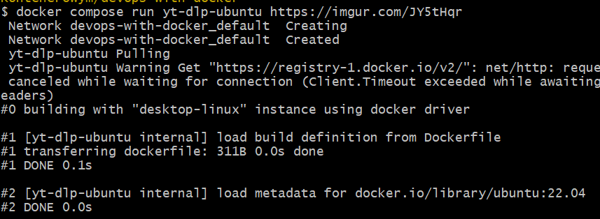

## Po chwilowych problemach z dockerem i dodaniu go do ścieżek w windowsie na nowo:

## Udalo sie uruchomic pierwszy kontener:

### Usuwanie kontenera i w ogóle 

## EXERCISE 1.1 AND 1.2

#### Ubuntu

#### Po bledach w terminalu zdecydowalem sie przerzucic na git basha:

## PART 2
 
Nie jestem pewien, czy to dobry pomysł pisać to dalej w jednym projekcie

### Tworzenie plików potrzebnych docker compose itd.

Usunalem napis version, gdyz podobno jest niepotrzebny juz od nowszych wersji dockera

Dodanie helo i world to poprzedniego pliku:

### dodanie adminera 

### zmiany dockerfile i docker compose

