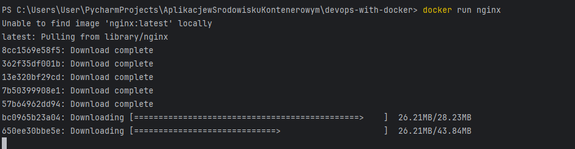
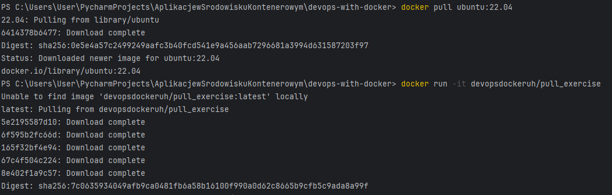

## Po chwilowych problemach z dockerem i dodaniu go do ścieżek w windowsie na nowo:

## Udalo sie uruchomic pierwszy kontener:

### Usuwanie kontenera i w ogóle 

## EXERCISE 1.1 AND 1.2

#### Ubuntu

#### Po bledach w terminalu zdecydowalem sie przerzucic na git basha:

