# Kurs Dockera na Curserze
#Pierwszy test
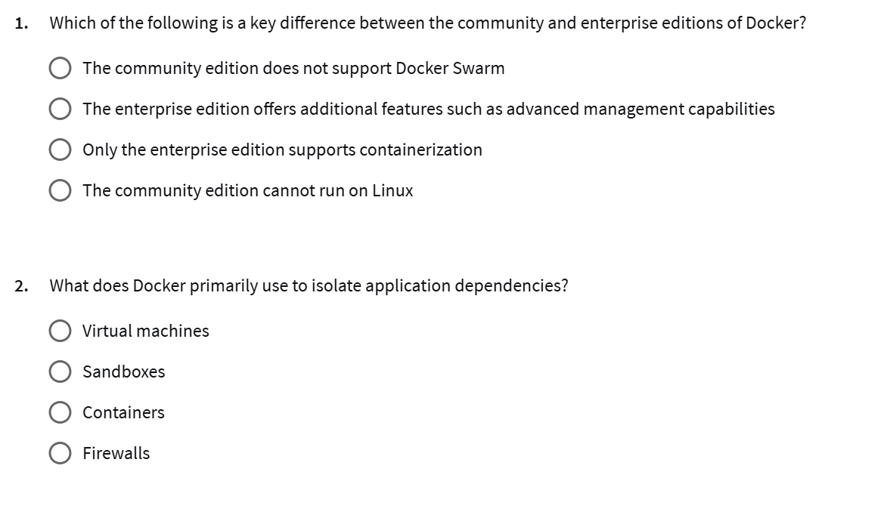
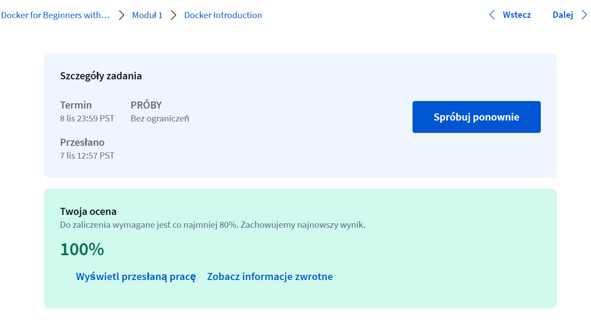
#Zaliczone

#Docker basic commands lecture
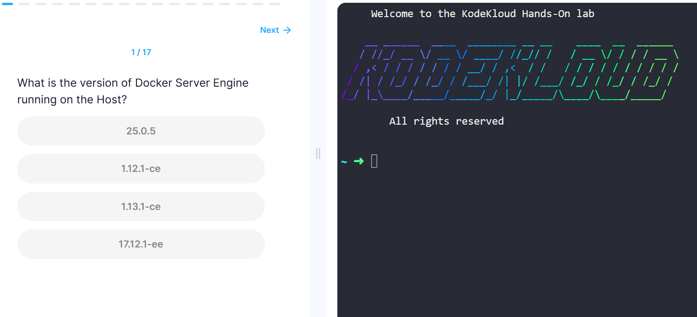
Test:
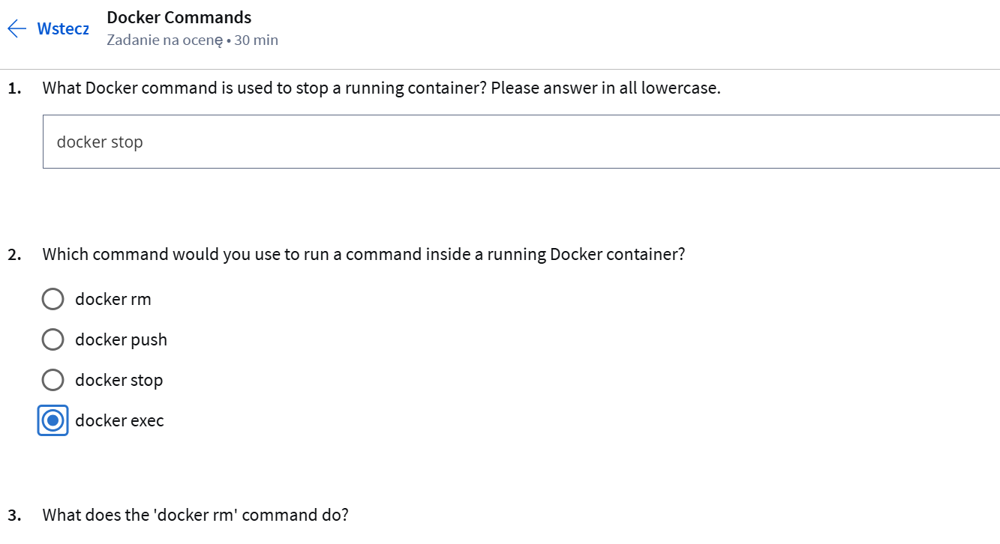
#Moduł 2:
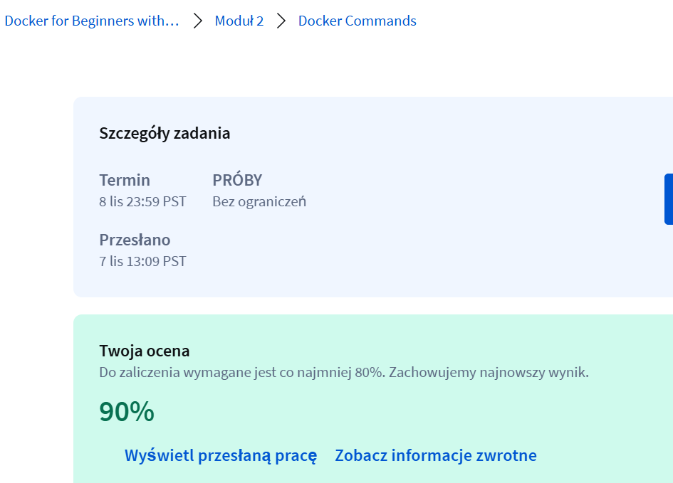

Modul3:
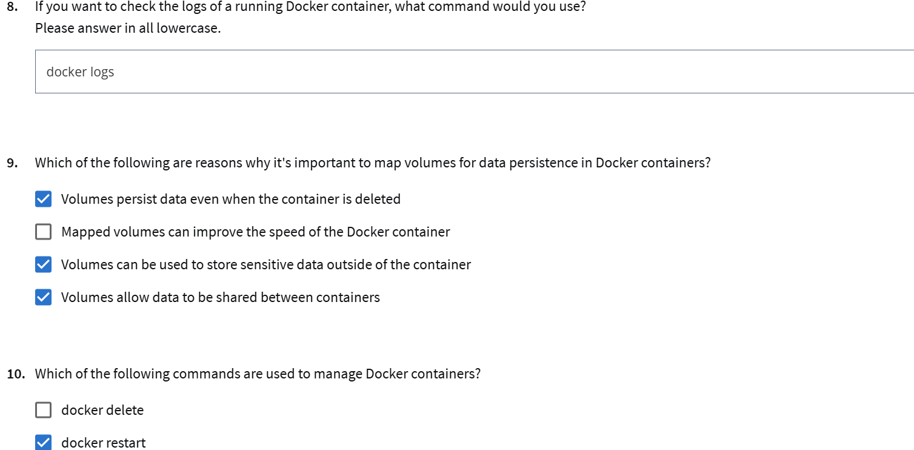
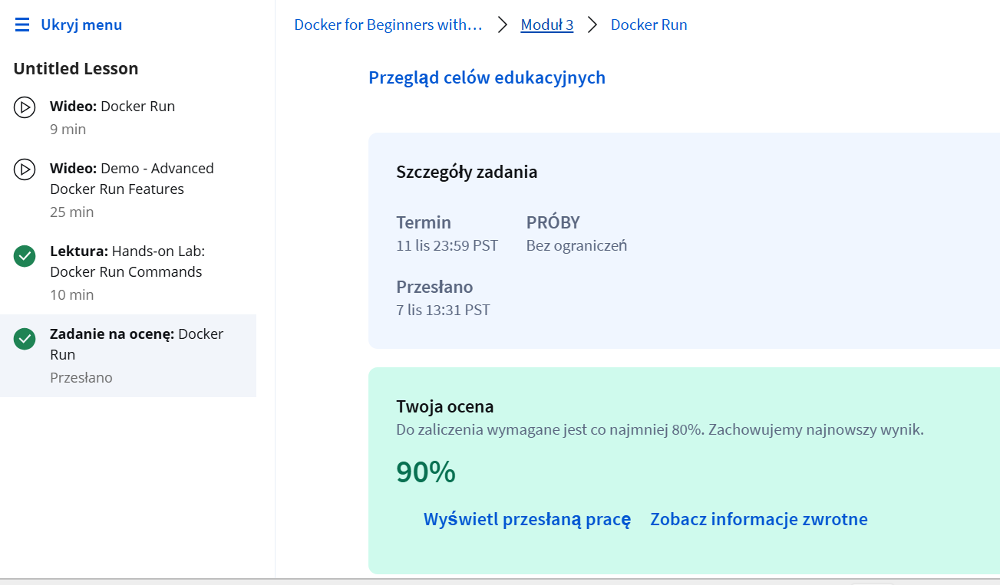

Modul 4:
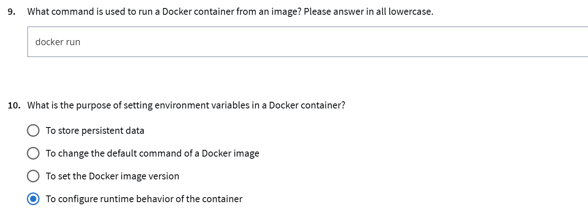
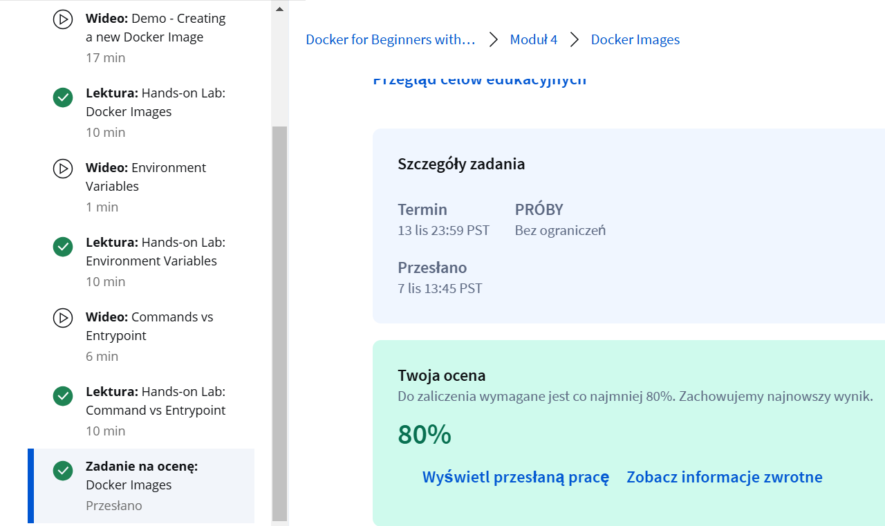

Modul5:
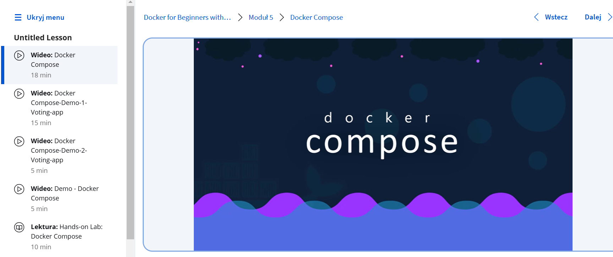
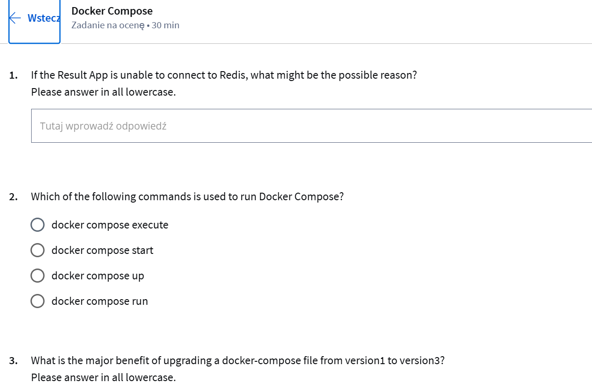
#tutaj po wielu probach udalo sie
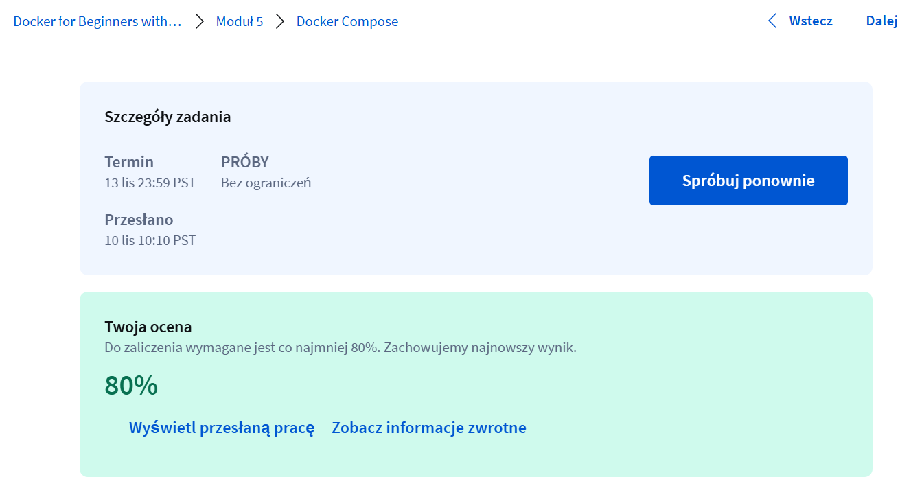

Modul 6:
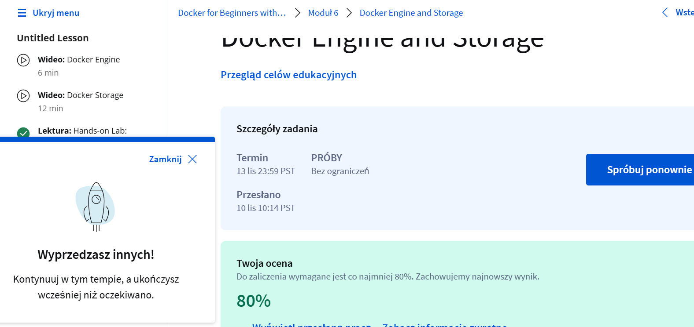

Modul7:

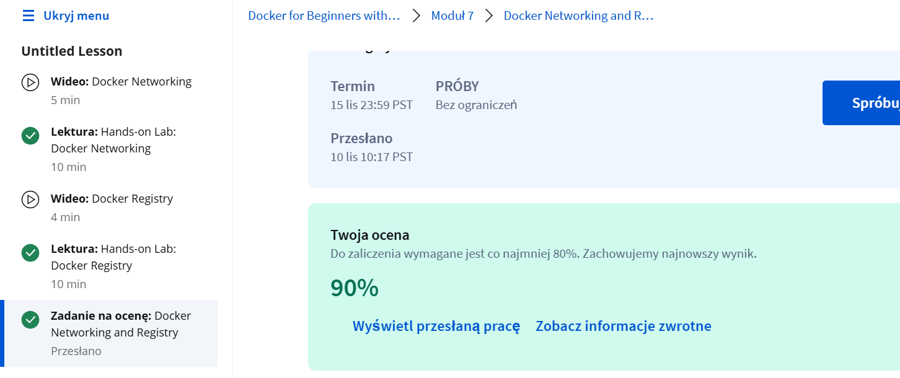

Modul8:

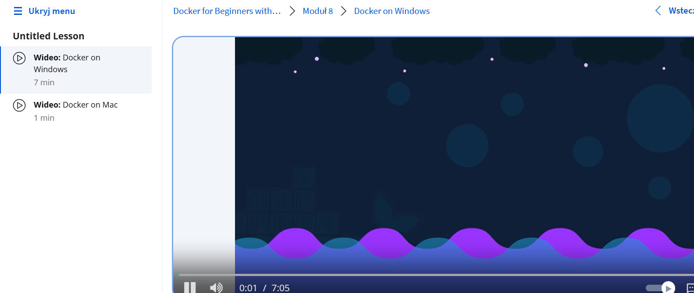

Modul9:
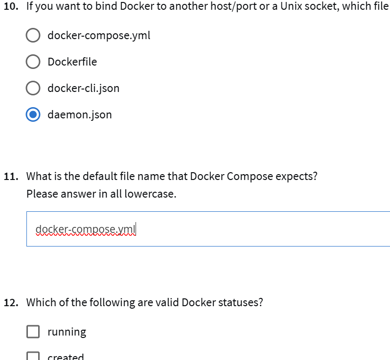
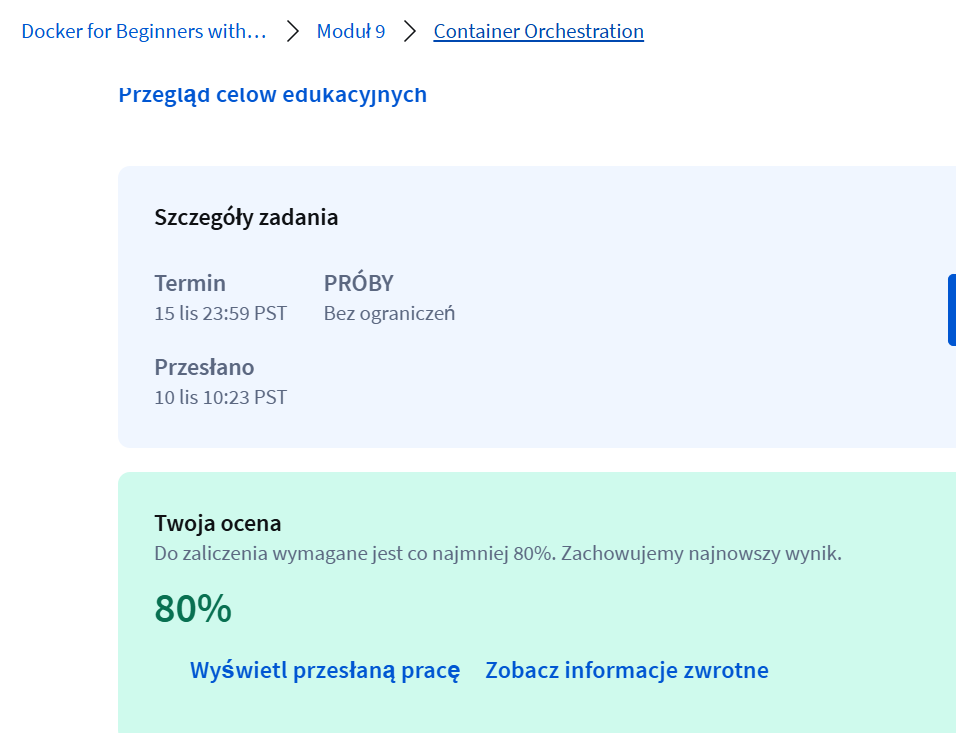

Modul10:
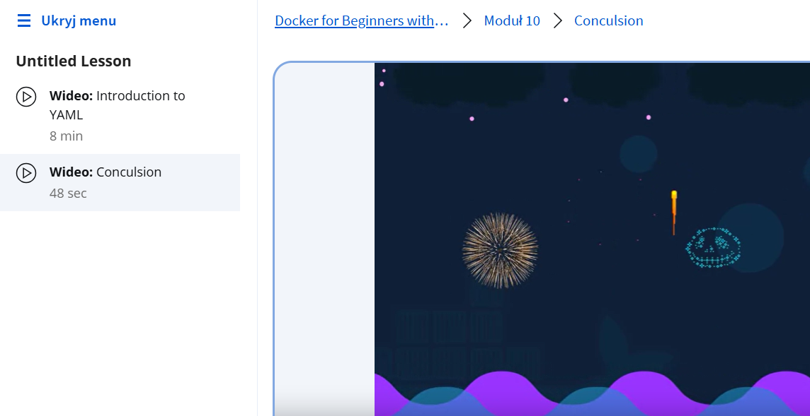

Koniec
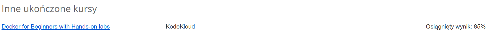
