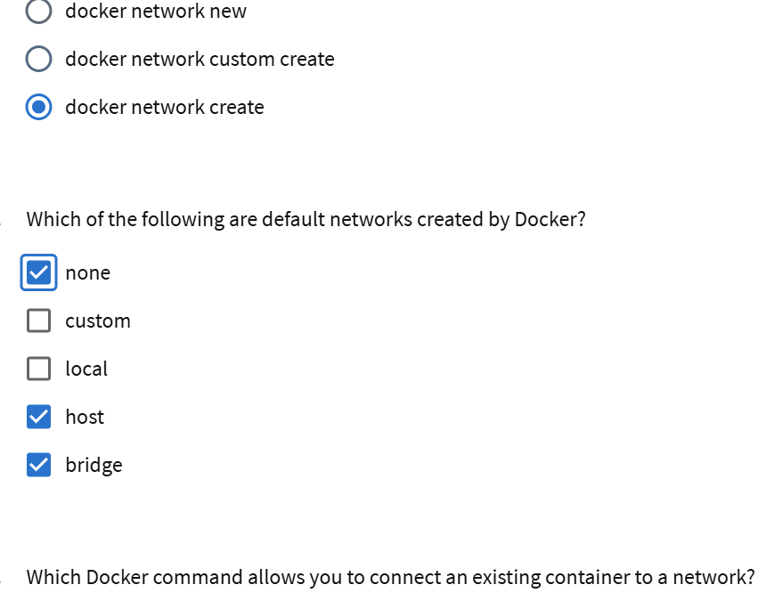

# Kurs Dockera na Curserze
#Pierwszy test

#Zaliczone

#Docker basic commands lecture

Test:

#Moduł 2:

Modul3:

Modul 4:

Modul5:

#tutaj po wielu probach udalo sie

Modul 6:

Modul7:

Modul8:

Modul9:

Modul10:

Koniec

